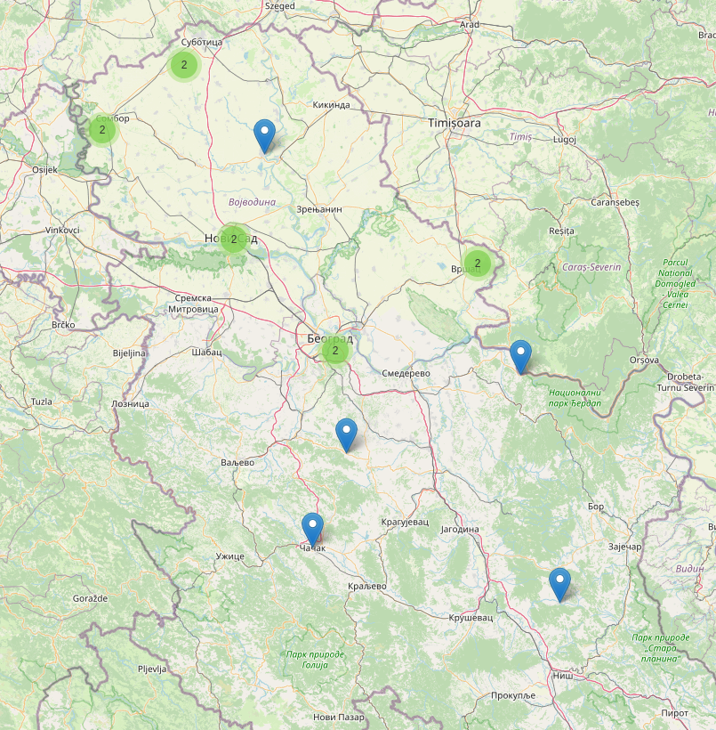

# City Mapper: Map Your Locations

A small script that takes city names as input and returns an interactive map saved to an HTML file.

## Description

I wanted to visualize the cities I've visited in Serbia. Here's an example of what the output looks like:



The map is created using Python and the [Folium](https://python-visualization.github.io/folium/) library for visualization, and [Geopy](https://geopy.readthedocs.io/) for geocoding the city names.

## Features

- Accepts multiple city names as input.
- Uses the `Folium` library to generate an interactive map.
- Marks the locations of the entered cities.
- Outputs an HTML file (`cities_map.html`) that you can open in any browser.

## Installation

1. Clone this repository:
   ```bash
   git clone https://github.com/TalkoDenis/cities_on_the_map.git
   cd cities_on_the_map
